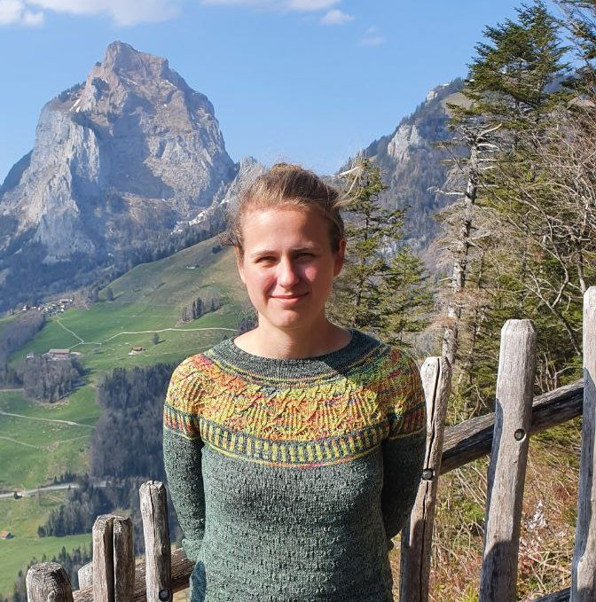

---
# Feel free to add content and custom Front Matter to this file.
# To modify the layout, see https://jekyllrb.com/docs/themes/#overriding-theme-defaults

layout: default
title: Julia Kastner
---
# Julia Kastner

Hi, I am a postdoctoral researcher in the [Cryptology Group](https://www.cwi.nl/en/groups/cryptology/) at CWI under the supervision of [Serge Fehr](https://homepages.cwi.nl/~fehr/). 
Before that, I was a member of the  [Foundations of Cryptography Group](https://foc.ethz.ch) at ETH Zurich where I graduated from my Doctoral Studies under the supervision of [Dennis Hofheinz](kjdf.de). 
Before that, I completed my BSc and MSc degrees in computer science at [Karlsruhe Institute of Technology](https://www.kit.edu)

Contact: firstname.lastname [ät] inf.ethz.ch

[DBLP](https://dblp.org/pid/209/1548.html) 

[Google Scholar](https://scholar.google.com/citations?user=iUKyNFEAAAAJ&hl=en) 

[ORCID](https://orcid.org/0000-0002-8879-8226) 

[researchgate](https://www.researchgate.net/profile/Julia-Kastner-7)
